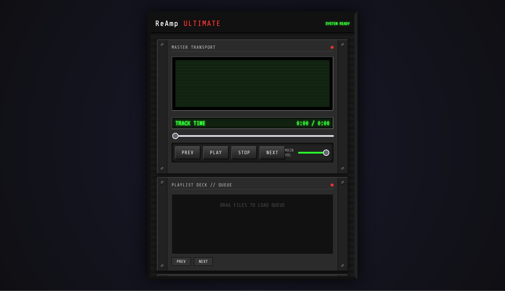

# ReAmp ⚡

> **No Electron. No Bloat. Just Sound.**
> *The spiritual successor to the golden age of media players, re-engineered for the modern streaming era.*



## 📜 Manifest

Modern music players have lost their way. They are memory-hungry web browsers disguised as apps. **ReAmp** is a return to form.

We believe a music player should open instantly, use minimal RAM, and look like a piece of high-tech machinery, not a flat website. ReAmp combines the tactile satisfaction of 90s interfaces (think Winamp 2.9) with the infinite library of 2025 (Spotify).

## ✨ Key Features

  * **Truly Native & Blazing Fast:** Written in low-level C++ for zero latency. Uses a fraction of the RAM of modern streaming apps.
  * **Retro GUI Engine:** Support for classic `.wsz` style skins, bitmap fonts, and pixel-perfect layouts.
  * **The Hybrid Engine:**
      * **Local Playback:** FLAC, MP3, OGG, WAV support with audiophile-grade decoding.
      * **Spotify Integration:** Stream your Spotify library directly through the ReAmp interface. (Requires Spotify Premium).
  * **Modular Plugin System:** Community-driven DSP effects, visualizations, and input plugins.
  * **Live Lyrics:** Auto-syncing lyrics fetched in real-time, displayed in a dedicated retro LCD-style window.
  * **Cross-Platform:** Desktop (macOS, Windows, Linux) and Mobile (iOS, Android) syncing via local network.

-----

## 🛠 Tech Stack

ReAmp is built on the metal, not on Chrome.

  * **Core Audio Engine:** C++ with Miniaudio backend
  * **GUI:** SDL2 + OpenGL (Metal/DirectX/Vulkan support planned)
  * **Scripting:** Lua integration for lightweight skin scripting and plugins
  * **Build System:** CMake

-----

## 🚀 Getting Started

### Prerequisites

  * **macOS:** Xcode Command Line Tools, CMake, SDL2, Lua
  * **Windows:** Visual Studio 2019+ or MinGW, CMake, SDL2, Lua
  * **Linux:** Build tools (gcc/clang), CMake, SDL2, Lua, OpenGL development libraries
  * **Spotify:** Client ID (for API integration - future feature)

### Installation

#### Quick Start (macOS/Linux)

```bash
git clone https://github.com/makalin/reamp.git
cd reamp

# Install dependencies (macOS with Homebrew)
make install-deps

# Or manually:
# macOS: brew install sdl2 lua cmake
# Linux: sudo apt-get install libsdl2-dev liblua5.3-dev cmake build-essential

# Build
make build

# Run
make run
# Or directly: ./build/bin/reamp
```

#### Manual Build

```bash
mkdir build && cd build
cmake -DCMAKE_BUILD_TYPE=Release ..
cmake --build . -j$(nproc)
./bin/reamp
```

#### Windows

```powershell
# Install dependencies via vcpkg or manually
# Then:
mkdir build
cd build
cmake -DCMAKE_BUILD_TYPE=Release ..
cmake --build . --config Release
.\bin\Release\reamp.exe
```

-----

## 🔌 Plugin Architecture

ReAmp supports three types of modules:

1.  **DSP (Digital Signal Processing):** EQ, Reverb, Bass Boost.
2.  **Vis (Visualizations):** Spectrum analyzers, oscilloscopes (MilkDrop compatible).
3.  **Source:** Add support for Soundcloud, Tidal, or FTP servers.

*Example Lua script for a simple visualization:*

```lua
function onRender(frequencyData)
    for i, val in ipairs(frequencyData) do
        drawBar(i, val, "0x00FF00") -- Classic Green
    end
end
```

-----

## 🗺 Roadmap

  - [ ] **v0.1 (Alpha):** Basic local playback, default "Classic" skin, 10-band EQ.
  - [ ] **v0.5 (Beta):** Spotify Connect integration, Playlist management.
  - [ ] **v1.0 (Gold):** Plugin marketplace, Mobile companion app (iOS/Android).
  - [ ] **Future:** Cloud sync for settings and skins.

-----

## 🤝 Contributing

We welcome pull requests from those who miss the days when software was optimized.

1.  Fork the Project
2.  Create your Feature Branch (`git checkout -b feature/RetroSkin`)
3.  Commit your Changes (`git commit -m 'Add support for .wsz skins'`)
4.  Push to the Branch (`git push origin feature/RetroSkin`)
5.  Open a Pull Request

-----

## 👤 Author

**Mehmet T. AKALIN**

  * **Company:** [Digital Vision](https://dv.com.tr)
  * **GitHub:** [@makalin](https://github.com/makalin)
  * **LinkedIn:** [Mehmet T. Akalin](https://www.linkedin.com/in/makalin/)
  * **X (Twitter):** [@makalin](https://x.com/makalin)

*Made with ❤️ in Türkiye. Keeping the retro spirit alive.*
